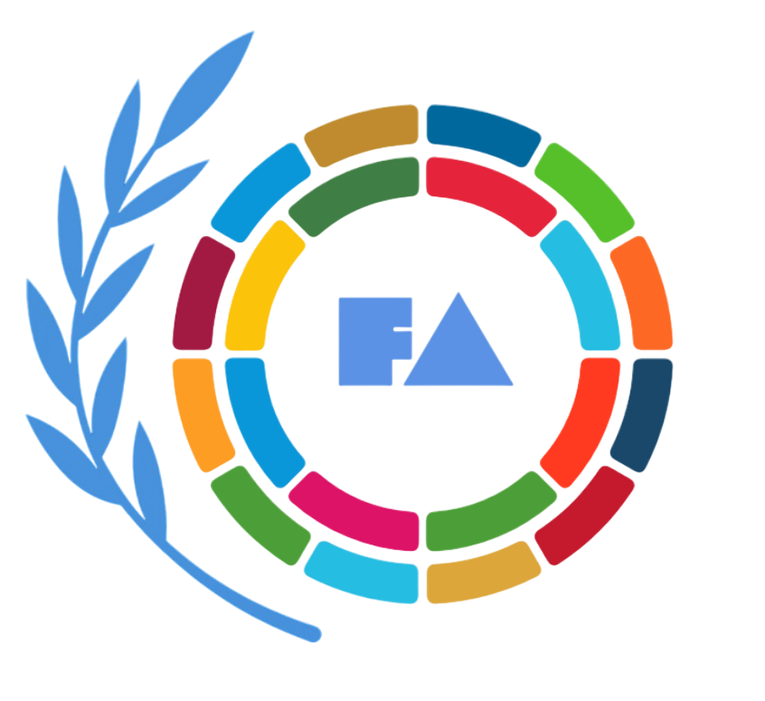

<div align="center">
  
</div>

# **Free Association Coalition**

**Draft: Participation Framework b1 v0.43**  
**Result of Informal Association COP30 2025**  
**Drafted by:** Initial working group convened at COP30 2025 coordination sessions  
**Contributors:** Coalition secretariat members and early adopter organizations

This coalition consists of entities experimenting with piloting new **Digital Public Goods (DPGs)** for voluntary coordination.

The **Free Association Coalition** (FAC) proposes a re-engineering of how collective action and resource allocation can be coordinated.

The key insight is separating:

1. **Publishing** (what is, what I have/need)  
2. **Derivation** (what we can infer collectively)  
3. **Recognition** (who/what contributes to my goals)  
4. **Allocation** (how we divide our capacities)

## **Implications & Significance**

### **Sovereignty and Interoperability**

Participants retain full control over their own data, recognitions, and priorities. They choose whose data to subscribe to. The system enables collaboration without requiring surrender of autonomy.

### **Automation of Cooperation**

The vision is to have a significant portion of capacity/resource allocation (funding, technical support) be automatically derived based on the state of network data, drastically reducing transaction costs and delays.

## **What Participants Can Do**

### **Publish Data**

Participants may publish: recognitions, capacities, needs, organizational membership, environmental data, qualities of entities/resources, sources for deriving, filters and their applications, or any other data.

**Examples:**

**Recognitions** (contribution percentages, always portions of 100%):

| Recognizer | Recognition | Attributed To |
|------------|-------------|---------------|
| WHO | 12% | Doctors without Borders |
| UNDP | 5% | UNICEF |
| … | … | … |

**Capacities**:

| Provider | Type | Quantity | Unit | Capacity Source |
|----------|------|----------|------|-----------------|
| WHO | Money | 50M | Dollars | Revenue |
| UNDP | Money | 10B | Dollars | Donations |
| UNICEF | Technical Support | 500 | Hours | Tech-Staff |

**Needs**:

| Recipient | Type | Quantity | Unit | Need Source |
|-----------|------|----------|------|-------------|
| Zimbabwe | Money | 50M | Dollars | Disaster-Relief |
| Tanzania | Money | 10B | Dollars | Climate-Transition |
| UNDP | Technical Support | 1000 | Hours | Tech-Staff |

**Organizational Membership** (using universal-unique-identifiers):

| Organization | Member IDs |
|--------------|------------|
| WHO | `uuid-1, uuid-2, uuid-3, ...` |
| UNDP | `uuid-a, uuid-b, uuid-c, ...` |
| Secretariat | `uuid-x, uuid-y, uuid-z, ...` |

**Environmental Data**:

| Scope | Variable | Value | Unit | Source |
|-------|----------|-------|------|--------|
| Space-Time-Coord-A | Temperature | 30 | Celsius | Weather-Station-1 |
| Space-Time-Coord-B | Sea-Level | 1.2 | Meters-Above-Mean | Tide-Gauge-3 |

**Qualities of Entities/Resources**:

| Entity | Quality | Value | Assessment Source |
|--------|---------|-------|-------------------|
| Solar-Panel-Project | Implementation-Readiness | High | Technical-Review |
| Community-Org-X | Local-Trust-Level | Verified | Community-Survey |
| Infrastructure-Asset | Climate-Resilience | Medium | Engineering-Assessment |

### **Derive Data**

Participants derive data from local and network-data: distributions, goals, estimates, needs, capacities, organizational membership, sources for deriving, filters and their applications, or any other data.

**Key distribution derivations:**
        
**1. Recognition:**

Each entity distributes their total recognition budget:

```
Total Recognition per Entity = 100%

For entity E recognizing contributors {C₁, C₂, C₃, ...}:
Σ Recognition(E → Cᵢ) = 100%

Properties:
- Non-transferable (cannot be sold or traded)
- Dynamically adjustable (update as relationships evolve)
- Percentages/portions (allocate based on contribution value)
```

**2. Mutual Recognition:**

Calculated as the lower of the recognition percentages that two entities assign to each other:

```
MR(entity-a, entity-b) = min(
    recognition-a-attributes-to-b,
    recognition-b-attributes-to-a
)
```

**3. Organizational Recognition:**

Each member's share calculation:

```
member-share = total-mutual-recognition-of-member-with-org-members
               ──────────────────────────────────────────────────
               total-mutual-recognition-in-organization
```

**Other derivable data includes:**
- Aggregated capacities across networks
- Unmet needs analysis
- Environmental estimates
- Goal alignment metrics  
- Resource offers and matches
- Any other computed insights

### **Propose, Offer, Allocate**

Participants can publish/propose/offer/allocate with the help of protocols of their choosing. See [Decision-Making Protocols](secretariat/) for options.

---

**Secretariat Purpose & Governance:**

* The Secretariat is a council governed by the coalition's adopted protocols. Its purpose is to offer open-source solutions to support coalition participants.

**Secretariat commits to:**

* invite  
  * its members to its assembly  
* assemble  
  * at least once per year  
* decide  
  * via adopted decision-making protocol  
* maintain (append only immutable public)  
  * record of its activity and decisions  
  * registry of its members  
  * registry of coalition participants it recognizes  
    * with one email / public-key per member as designated contact point

**Secretariat can:**

* express  
  * proposals  
  * statements  
* invite  
  * others to join the secretariat  
  * consultants to advise the secretariat  
* allocate  
  * assets allocated to the secretariat's custody

**Secretariat Member can:**

* express  
  * proposals  
  * positions towards proposals according to the secretariat's decision-making protocol:  
    * support  
    * challenge (raise concerns)  
    * oppose  
    * abstain

**General Information:** openassociation.org  
**Documentation:** docs.openassociation.org  
**Coalition Inquiries:** coalition@openassociation.org  
**Secretariat Record:** [record.openassociation.org](http://record.openassociation.org)

**Drafting Process:**  
This framework is emerging through iterative refinement during informal coordination sessions at COP30 2025. The structure prioritizes sovereignty, automation of cooperation, and interoperability. Feedback cycles are incorporating insights from potential member organizations spanning UN agencies, national governments, and civil society networks.

**Next Steps:**

* **Set up Contact Registration Infrastructure**  
* **Founding Member Contact Registration** \- Member 1 registers their contact information and PGP public key  
* **Founding Member Contact Registration** \- Member 2 registers their contact information and PGP public key  
* **Founding Member Contact Registration** \- Member 3 registers their contact information and PGP public key  
* **Initial Secretariat Membership Declaration \-** Formal declaration that these three members form the Secretariat  
* **Founding Declaration Statement** \- Official founding statement declaring the establishment of the Free Association Coalition Secretariat at COP30 2025  
* **Proposal to Adopt Decision-Making Protocol** \- Member 2 proposes adopting the Iterative Consensus Protocol as the Secretariat's decision-making mechanism  
    
  ***\<The following is contingent on the specific Decision-Making Protocol adopted\>***  
    
* **Support Expression from Member 1** \- Member 1 expresses full support (weight: 1.0) for the protocol proposal  
* **Support Expression from Member 3** \- Member 3 expresses full support (weight: 1.0) for the protocol proposal  
* **Support Expression from Member 2 (Proposer)** \- Member 2 (the proposer) expresses full support (weight: 1.0) for their own proposal  
* **Decision Outcome — Protocol Adoption** \- The protocol is adopted via unanimous support (3.0 aggregate weight, early adoption path)  
* **Protocol Adoption Record (Formal)** \- Formal record of the Iterative Consensus Protocol v1.0.0 adoption with content hash  
* **Framework Version Record \-** Records Participation Framework version b1 v0.43 as the initial bootstrap version  
* **Invitation to Founding Assembly \-** Member 3 invites all members to the founding assembly  
* **Assembly Response — Member 1** \- Member 1 accepts the assembly invitation  
* **Assembly Response — Member 2** \- Member 2 accepts the assembly invitation  
* **Assembly Response — Member 3** \- Member 3 accepts the assembly invitation  
* **Founding Assembly Minutes \-** Official minutes from the founding assembly including decisions made, action items, and next assembly date

---

**See [Appendix](appendix.md) for detailed technical clarifications and coalition benefits.**
